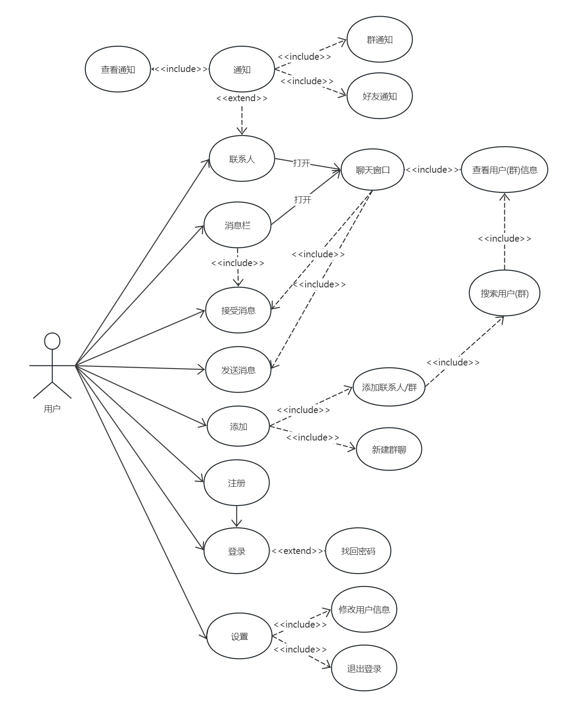

## 1、项目可行性分析

### 1.1 技术可行性分析

在技术方面，我们采用了以下架构和工具：

- **操作系统**：前端开发使用 Windows 10 或更新版本，后端开发使用 Linux。
- **前端开发工具**：我们选择了 Qt 6.6.0 进行桌面图形开发。
- **代码同步工具**：我们使用 Git 进行代码的组织和同步。
- **数据库**：我们使用 MySQL 进行数据存储与管理。
- **后端语言**：我们使用 Python 进行后台系统和接口的构建。
- **计算机网络架构**：使用经典的客户端/服务器（C/S）模型。
- **网络通信**：前后端通信采用 Socket，并使用 JSON 进行数据交换。

这些技术和开发工具都是比较简单的或者在学校中有所接触了解，具体优势及选择原因：

- **Windows桌面系统**：作为用户量最大的桌面操作系统，使用上没有太大问题。
- **Linux桌面系统**：桌面版的Linux系统(Ubuntu)提供图像界面，更易使用，也方便作为本地服务器进行测试
- **Linux服务器**：可看作只有终端的Linux桌面系统，学习一些基础指令即可完成大部分功能。
- **Qt**：具有图形化UI界面，在基础控件的使用上与cocos2d-x相似，且具有详细规范的开发文档与学习资源，学习起来很容易上手。
- **MySQL**：具有较高的性能和稳定性，此外它支持跨平台操作，可以在各种操作系统上运行
- **Python**：具有简单易学、代码简洁、生态丰富等优点。
- **Socket**：通过Socket，前后端可以方便地进行数据交换和通信。
- **Git**：操作简单，易于理解，可以有效地管理多人的开发过程，确保代码的组织和同步，且大部分现代IDE都有提供Git图形操作界面。
- **JSON**：作为轻量级的数据交换格式，JSON易于人的阅读和编写，且大多数语言都有解析JSON的模块或者第三方库，可以方便的在多种语言之间进行数据交换。

综上所述，我们认为这些技术的选择可以使得开发过程具有较低的难度和阻力，并且可以辅助使用 ChatGPT 进行开发，从技术层面来看是可行的。

### 1.2 经济可行性分析
“MyChat”聊天软件的开发中虽然使用了适合Windows的免费开发系统和工具，减少了初期的技术投入，但由于软件预定要公网上线，我们需要考虑到额外的成本，包括服务器的费用，以及确保数据加密和用户隐私保护的相关开支。由于“MyChat”仅支持Windows平台，这简化了开发流程并减少了需要为多个操作系统进行适配和测试的成本。然而，我们仍需进行充分的测试以确保软件在Windows环境下的稳定性和性能。

**开发成本分析表**

| 项目     | 费用               |
| :------- | :----------------- |
| 软件投入 | ¥0          |
| 硬件投入 | ¥2,2500    |
| 系统开发 | ¥0         |
| 运行维护 | ¥2000/户   |
| 成本总计 | ¥2,4500    |

**收益分析表**

| 项目         | 收益                |
| :----------- | :----------------- |
| 软件费用      | ¥6000 /套|
| 每年维护费用  | ¥3000 /年 |
| 广告费用      | ¥？      |
| 收益总计      | ¥？      |

**分析说明：**

**开发成本：**

- **软件投入**：开源软件以及免费软件。
- **硬件投入**：用于测试和开发的服务器和设备,需要服务器和对应的windows的设备进行软件测试，确保稳定性。
- **系统开发**：软件开发人员和用户界面设计人员来构建和完善软件，确保用户体验。
- **运行维护**：包括服务器租用费、软件更新、技术支持和数据备份等费用。

**收益：**

- **软件费用**：用户支付一次费用，获得软件的永久使用权。
- **广告收入**：通过软件内广告来生成收入，这部分收益依赖于用户的活跃度和广告策略的效果。
- **每年维护费用**：服务器费用，数据备份和恢复，软件升级和补丁以及技术支持。

从长期来看，如果"MyChat"能够吸引足够数量的用户，并有效地管理运营成本，项目的经济可行性将是正面的。然而，要达到盈利状态，项目团队需要有效地执行市场推广策略，持续增加用户基础，并优化收益模型。

### 1.3 操作可行性分析

### 1.4 社会可行性分析

## 2、UML

### 2.1 用例

<b>用例图：</b>

<b>规约描述：</b>

#### 2.1.1 登录

- **参与者**： 用户
- **触发条件**： 启动软件后自动触发
- **前置条件**： 用户已经下载并打开了聊天软件。
- **后置条件**： 登录成功跳转到软件主界面，登录失败弹出登录失败对话框
- **基本流程**：
  1. 系统显示登录信息填写界面
  2. 用户输入账号密码
  3. 系统检验账号密码格式是否正确
  4. 系统检验账号是否存在
  5. 系统检验账号密码是否匹配
  6. 登录成功，跳转到主界面
- **扩展流程**：
  1. 如果账号密码格式错误，则提示用户，并返回基本流程2
  2. 如果账号不存在，则提示用户，并返回基本流程2
  3. 如果账号密码不匹配，则提示用户，并返回基本流程2

#### 2.1.2 注册
- **参与者**： 用户
- **触发条件**： 用户在登录界面点击注册
- **前置条件**： 用户已经进入登录界面
- **后置条件**： 注册成功跳转到登录界面，注册失败弹出注册失败对话框
- **基本流程**：
  1. 系统显示注册信息填写界面
  2. 用户输入账号密码
  3. 系统检验账号密码格式是否正确
  4. 系统检验账号是否存在
  5. 注册成功，跳转到登录界面
- **扩展流程**：
  1. 如果账号密码格式错误，则提示用户，并返回基本流程2
  2. 如果账号不存在，则提示用户，并返回基本流程2
#### 2.1.2 

- **参与者**：
- **触发条件**：
- **前置条件**：
- **后置条件**：
- **基本流程**：
  1. 
- **扩展流程**：
  1. 